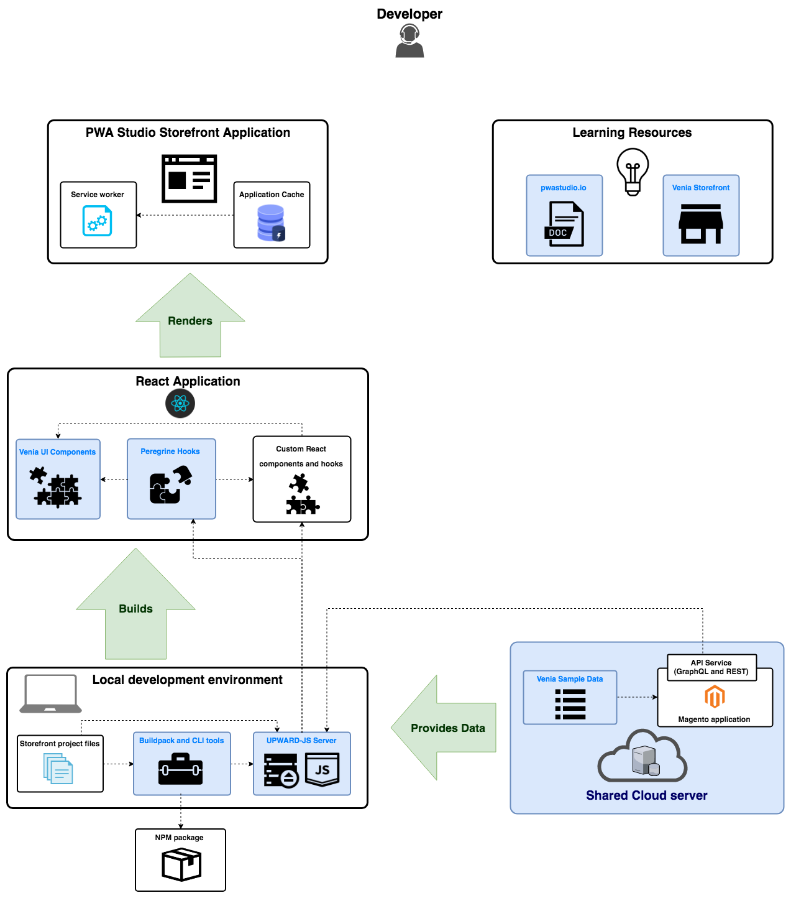

# PWA Studio project overview

PWA Studio is a set of tools and libraries that let you create Progressive Web Apps (PWA).
This page provides a brief description of a Progressive Web App and its relationship to the PWA Studio project.

## What is a Progressive Web App

A Progressive Web App, or PWA, is a term for any web application that uses modern web technologies and design patterns to provide a reliable, fast, and engaging user experience.

The following features define a basic PWA website:

- **Fast** - PWA sites use a variety of performance optimization strategies to provide a responsive experience or load content fast, even on slow networks.
- **Secure** - PWA sites use HTTPS connections for enhanced security.
- **Responsive** - PWA sites implement responsive design strategies to provide a consistent experience on desktops, tablets, and mobile devices.
- **Cross-browser compatible** - PWA sites work equally well on all modern browsers, such as Chrome, Edge, Firefox, Safari.
- **Offline Mode** - PWA sites cache content to ensure that some content can be served when a user is offline.
- **Mobile "Install"** - Mobile users can add PWA sites to their home screens and even receive Push notifications from the site.
- **Shareable content** - Each page in a PWA site has a unique URL that can be shared with other apps or social media.

The [RAIL][] model lays out the user-centric goals for PWA websites:

[rail]: https://web.dev/rail/

- **Response** – An application is receptive to the user's request.
- **Animation** – It shows a movement to keep the user pausing.
- **Idle** – A PWA utilizes the "idle" second to cache content.
- **Load** – It loads under a moment.

Learn more about Progressive Web Apps:

- [web.dev][]
- [developer.mozilla.org][]
- [developers.google.com][]

[web.dev]: https://web.dev/progressive-web-apps/
[developers.google.com]: https://developers.google.com/web/updates/2015/12/getting-started-pwa
[developer.mozilla.org]: https://developer.mozilla.org/en-US/docs/Web/Progressive_web_apps

## What is the PWA Studio project

The PWA Studio project is a set of developer tools and libraries that let you develop, deploy, and maintain a PWA storefront on top of an Adobe Commerce or Magento Open Source backend.
It uses modern [tools and libraries][] to create a build system and framework that adheres to the principles of extensibility.

[tools and libraries]: /guides/project/tools-libraries/

### Build tools

The `pwa-buildpack` package contains the main build and development tools for your PWA Studio project.
It provides features such as project setup tools, configuration management, and an extensibility framework.

When you use the CLI tool in this package to [set up a new storefront project][], it bundles and incorporates these tools into your new project to help you get started.

[set up a new storefront project]: /tutorials/setup-storefront/

### Custom React hooks and component

The `venia-ui` and `peregrine` packages contain custom React hooks and components for your PWA Studio project.

The `venia-ui` package provides React components that render the HTML structure of UI components in your storefront.
It uses components from the `peregrine` package, which provide components that manage state, calculate values, and fetch data from the backend.

These packages work together to provide features for your storefront project, but you can also pick and choose which components you need for your own customizations.

### Demo storefront and backend

The `venia-concept` package provides a template for a PWA Studio storefront project.
When you [set up a new storefront project][], you get a copy of the content in this package, which is a fully operational storefront you can customize.

The PWA Studio team also provides a shared Adobe Commerce instance to all PWA Studio developers to help you get started with development.
The team updates and maintains this instance to ensure you are developing on the latest Adobe Commerce version.
This server also contains sample data for a fashion store to show the different features available from PWA Studio libraries.

### Other notable packages

Other notable packages in PWA Studio include:

- **[UPWARD][]** - A proxy-server concept that describes a highly configurable server that sits between the PWA storefront and backend services
- **[PageBuilder][]** - PageBuilder extension for PWA Studio

### UI Kit

[PWA Studio UI Kit](https://developer.adobe.com/commerce-xd-kits/): Expedite your Adobe Commerce storefront design with a UI Kit built in Adobe XD.

[upward]: /guides/packages/upward/
[pagebuilder]: /integrations/pagebuilder/
