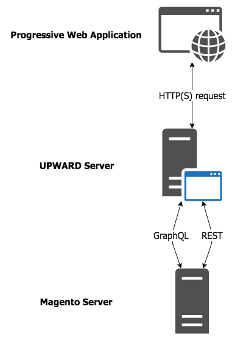

# UPWARD

UPWARD is an acronym for Unified Progressive Web App Response Definition.
Depending on the context, UPWARD can refer to the definition file or server implementation.

## Definition file

An UPWARD definition file describes how a server delivers and supports an application.
The file provide details about server behavior using platform-independent, [declarative][] language.
This lets an application run on top of any UPWARD-compliant server written in any language because the application is only concerned about the HTTP endpoint behavior from the UPWARD server.

[declarative]: https://en.wikipedia.org/wiki/Declarative_programming

An UPWARD server uses an application's definition file to determine how the server should handle a request and build the response for it.

## Server implementations

The main purpose of an UPWARD server is to do the following:

1. Receive a request from the application
1. Determine the appropriate service or process to handle the request
1. Get the results from the service or process
1. Build the HTTP response from the results
1. Send the response back to the application

PWA Studio provides two UPWARD server implementations:

- [upward-js][]: A JavaScript implementation of an UPWARD server.
  This is often used during development, but it can also be used as a production server if your backend service allows node processes.

- [upward-php][]: A PHP implementation of an UPWARD server used in conjunction with the [magento2-upward-connector][].
  This is mainly used in production environments where the storefront project code and Magento 2 backend code are on the same server.

[upward-js]: /guides/packages/upward/javascript/
[upward-php]: https://github.com/magento/upward-php
[magento2-upward-connector]: https://github.com/magento/magento2-upward-connector

### UPWARD server characteristics

UPWARD server implementations have the following characteristics:

#### Idempotent

Requests sent to an UPWARD server are [idempotent][].
This means that a request to the server has no side effects, so
it does not matter if you send the same request multiple times to the server.

[idempotent]: https://developer.mozilla.org/en-US/docs/Glossary/Idempotent

#### Provide a simple communication strategy for services

All services provided by the server are available through a single data exchange strategy, such as GraphQL.
Limiting the methods of communication between a PWA and its resources simplifies PWA development.
It removes the responsibility of knowing how to work with different external resources and
allows developers to concentrate on using a single, familiar technology.

#### Contain no business logic

Having business logic spread across multiple architectural layers is an antipattern that harms testability.
The declarative nature of an UPWARD specification prevents the creation of arbitrary business logic on the server.
It pushes this logic into re-usable templates or queries, the frontend application, or the backend services, so it cannot hide in the middle tier.

#### Stateless

Since an UPWARD server cannot contain business logic, it also cannot hold a local state.
This responsibility is also moved to the frontend or backend layer.

#### Secure

UPWARD server implementations must serve data over [HTTPS][] to protect the information and privacy of PWA users.

[https]: https://developers.google.com/web/fundamentals/security/encrypt-in-transit/why-https

#### Support caching

An UPWARD server itself is not a cache,
but it must serve static resources from [edge servers][] when possible.
This supports the need for content that a PWA can [cache and reuse when offline][].

[edge servers]: https://en.wikipedia.org/wiki/Content_delivery_network
[cache and reuse when offline]: https://developers.google.com/web/fundamentals/instant-and-offline/offline-cookbook/

## UPWARD and PWA Studio storefronts

An UPWARD server sits between a PWA Studio storefront and its resources, such as an Adobe Commerce or Magento Open Source application.
It acts as the backend service for the application that proxies requests to connected services or serve static files.

See [RATIONALE.md][] in the `upward-spec` package for a more detailed explanation of the need for an UPWARD server.

[rationale.md]: https://github.com/magento/pwa-studio/blob/master/packages/upward-spec/RATIONALE.md

## UPWARD in Venia

When you [set up a new project][], the scaffolding tool creates an UPWARD definition file called `upward.yml` in the new project.
This file contains references to a `veniaResponse` object defined in the [`venia-ui` package][].

[set up a new project]: /tutorials/setup-storefront/
[`venia-ui` package]: https://github.com/magento/pwa-studio/blob/develop/packages/venia-ui/upward.yml

To deploy your storefront application, pass this file onto an UPWARD server to make it accessible to users.

### Changing the default Venia responses

To change the default UPWARD server behavior from a Venia-based project, you must change the configuration file.

The most direct way to do this is by editing the `upward.yml` file and changing the values for the `status`, `headers`, and `body` properties.
You can refer to the `upward.yml` file in the [`venia-ui` package][] to see the default instructions and make the necessary changes.

You can also tap into the [`transformUpward` target][] in your storefront or extension project to make changes in a more programmatic language.
See the [`upward-security-headers` extension][] for an example of this approach.

[`transformupward` target]: /api/buildpack/targets/
[`upward-security-headers` extension]: https://github.com/magento/pwa-studio/blob/develop/packages/extensions/upward-security-headers/intercept.js
