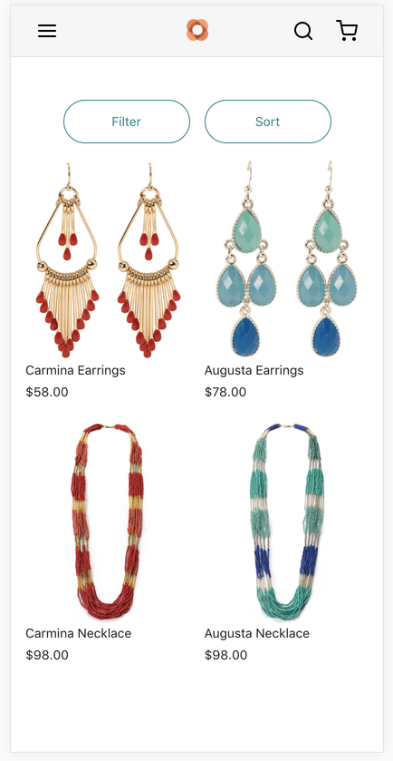
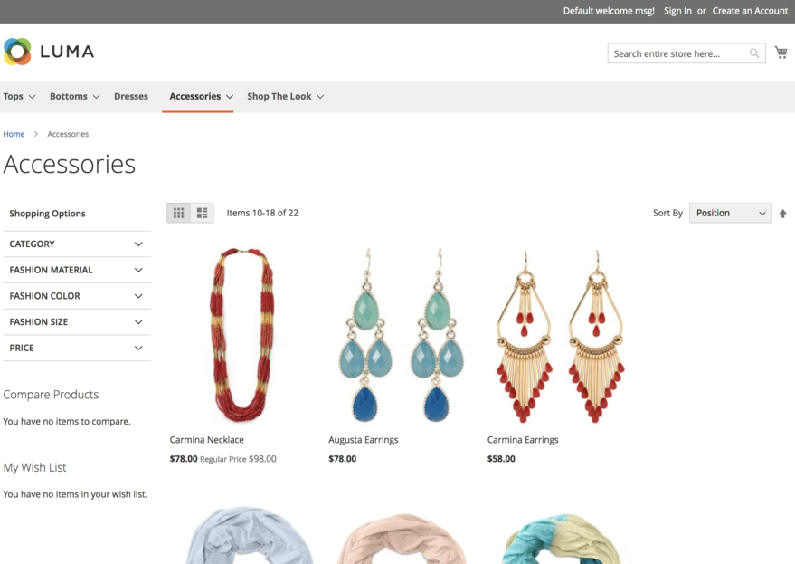

# Venia sample data

The [Venia demo storefront][] runs on top of an Adobe Commerce backend that has a specific set of sample data installed.
The sample Adobe Commerce backend available to developers also contains the same sample data set.

[venia demo storefront]: https://venia.magento.com/



## Installing the Venia sample data

If you have access to your own Adobe Commerce or Magento Open Source backend and you want to install the Venia sample data, follow these instructions.

### Step 1. Copy or create the deploy script

Copy the [deployVeniaSampleData.sh][] script into the root directory of your backend installation.
A copy of this script is also included when you [setup your storefront project][].

[deployveniasampledata.sh]: https://github.com/magento/pwa-studio/blob/develop/packages/venia-concept/deployVeniaSampleData.sh
[setup your storefront project]: /tutorials/setup-storefront/

### Step 2. Execute the deploy script

Execute the script in the root directory of your application to add the Venia sample data modules to the backend application:

```sh
bash deployVeniaSampleData.sh
```

### Step 3. Install the sample data modules

Run the following command in the application root directory to install the Venia data from the modules:

```sh
bin/magento setup:upgrade
```

### Step 4. Reindex the new data

Run the following command in the application root directory to reindex the data from the modules:

```sh
bin/magento indexer:reindex
```

### Step 5. Verify installation

Log into the Admin section or visit the store of your Adobe Commerce or Magento Open Source instance to verify the sample data installation.


