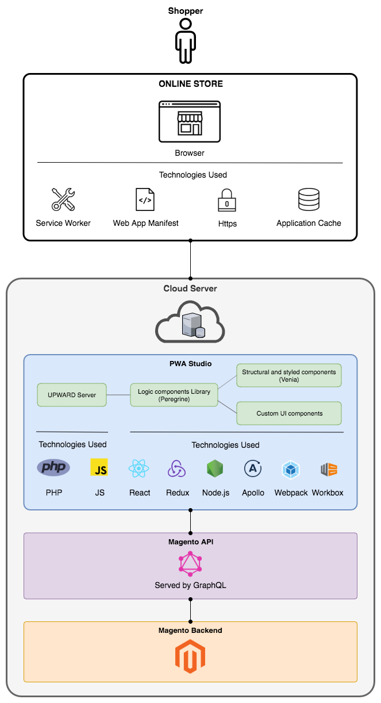

# External tools and libraries

The following diagrams describe the route a request takes through PWA Studio and the technologies involved at each step.
This topic provides an overview to some of the major technologies used and other resources.

## PHP

[PHP][] is the core language used in the Adobe Commerce and Magento Open Source application, but it is not one used by the main PWA Studio project.
In general, you do not need to know PHP to work with PWA Studio tools, but if your storefront requires heavy customizations to the backend application, you will need to know PHP to make the necessary changes.

## JavaScript

[JavaScript][] is a programming language used to add logic and interactive behaviors to web applications.
JavaScript is the primary language used in the PWA Studio project, and knowing how to develop with it is necessary for using PWA Studio in your own projects.

For frontend development, browser compatibility is important for creating a consistent experience.
Different web browsers have different version of JavaScript installed, so developers should build their applications with this in mind.

For backend developers, scripts and services in PWA Studio are created using [node.js][].
It is the environment used in the PWA Studio project, but it is not a required one for your own projects.

## webpack

[webpack][] is a configuration-driven asset bundler and optimizer for JavaScript applications.

webpack's primary function is to create one or more bundles from the dependencies in your project's modules.
webpack is also able to transform, package, or optimize resources and assets using plugins.
This allows you to extend webpack's functionality beyond JavaScript bundling.

The [pwa-buildpack][] library contains webpack tools for setting up a development or production environment.
The configuration for these tools are found in a project's `webpack.config.js` file.

webpack is not a required library for your own projects, but it is recommended for the development and performance benefits it provides.

## React

[React][] officially describes itself as a _JavaScript library for building user interfaces_.
The library provides the following features that make PWA development easier:

- **Simple** - The React library does one thing: build a user interface.
  It does this without making assumptions about the underlying technology stack.
  This flexibility gives you the freedom to choose the appropriate solutions for the rest of your project.

- **Declarative** - Creating a complex user interface is difficult when working directly with the DOM API.
  React allows you to describe how your interface should look for a specific application state, and
  the library takes care of rendering the UI correctly when the state changes.

- **Modular** - React encourages developers to create modular and reusable components.
  Taking a modular approach to development makes your code easier to debug and maintain.

### Hooks

[React hooks][] are a feature introduced in React 16.8.
They allow the use of state and logic encapsulation without using class components.

Since hooks allow you to store state inside functional components, they are a good alternative to using [Redux](#redux).

The [Peregrine][] library provides custom hooks for common storefront behaviors and logic.
Developers must be familiar with using hooks to get the most out of the PWA Studio library.

## Redux

[Redux][] is a JavaScript library used for managing state in a web application.

It provides a global store object that holds application state that multiple components depend on.
Components that plug into the store have direct access to the specific state data they need.

This library is often paired with React to alleviate the problem of passing data down multiple component layers.

<InlineAlert variant="info" slots="text"/>

Redux is currently being refactored out of the [Venia example storefront][] in favor of [React hooks](#hooks).
However, Redux is still a valid library for managing state in your own projects.

## GraphQL

[GraphQL][] is a specification for a data query language on the client side and a service layer on the server side.
It is often seen as an alternative to using [REST][] endpoints.

One of the main advantages GraphQL has over REST is that a single GraphQL endpoint can accommodate requests for any combination of X, Y, and Z pieces of data,
whereas REST requires specialized endpoints for different data request combinations.
Unlike REST, which can require multiple server requests to aggregate data, a single GraphQL request returns only the data needed and nothing more.

Performance is an important metric for PWAs.
Using GraphQL improves this by reducing the number of server calls and the amount of data returned.

The [Venia example storefront][] uses the [Apollo client][] to fetch data from a GraphQL endpoint, but with a little extra work, it is possible to use alternative client libraries in your own project.

## Workbox

Google's [Workbox][] library provides modules that make it easy to work with [service workers][].
It is useful for boosting performance by controlling cache behavior and enables offline mode, which is a requirement for any Progressive Web Application.

## PWA Studio UI Kit for Adobe XD

Adobe XD makes handoff between designers and engineers more efficient through easy-to-use collaboration tools. The [PWA Studio UI Kit](https://www.adobe.io/commerce-xd-kits) contains a collection of templates and components compatible with Adobe Commerce.  

[service workers]: https://web.dev/articles/service-workers/
[php]: https://www.php.net/
[javascript]: https://developer.mozilla.org/en-US/docs/Learn/JavaScript
[webpack]: https://webpack.js.org/
[react]: https://legacy.reactjs.org/
[redux]: https://redux.js.org/
[graphql]: https://graphql.org/
[workbox]: https://developer.chrome.com/docs/workbox/
[rest]: https://en.wikipedia.org/wiki/REST
[apollo client]: https://www.apollographql.com/docs/react/why-apollo/
[venia example storefront]: /guides/packages/venia/storefront/
[peregrine]: /guides/packages/peregrine
[react hooks]: https://legacy.reactjs.org/docs/hooks-intro.html
[node.js]: https://nodejs.org/en/about/
[pwa-buildpack]: /guides/packages/buildpack/
