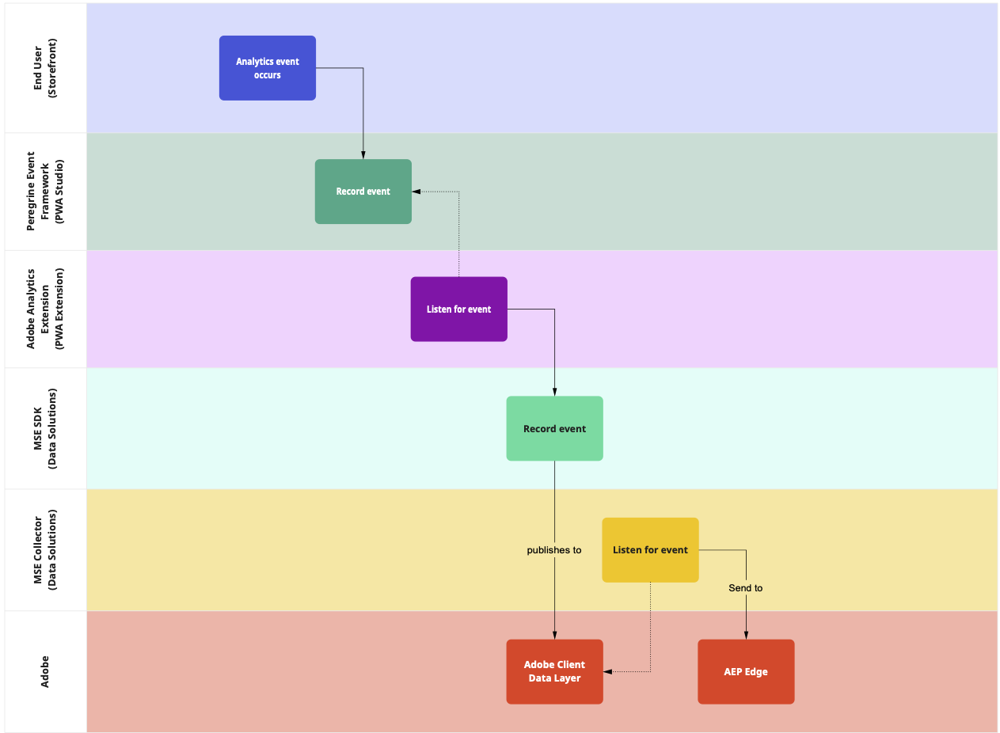

# Adobe Experience Platform

Included in the PWA Studio 12.5.0 release is an eventing framework that lets merchants install extensions that track user interaction within their site and collect analytics information.
With the Data Connection extension, Adobe Commerce users with an Adobe Experience Platform (AEP) subscription can get event data from PWA Studio storefronts and process it on the Experience Platform.

This integration requires the following pieces to function properly:

- The Data Connection extension for PWA Studio storefronts, which connects and sends data to the Experience Platform.
- The Experience Platform extensions installed in the Adobe Commerce backend, which provides configuration information to the storefront extension.

This diagram shows the basic flow of an event through the system and notes which component handles the event at each stage.



The following sections provide installation and configuration instructions for the Experience Platform integration.
Magento Open Source does not support the Experience Platform.

## Install the Experience Platform extension for PWA Studio

Use your storefront project's package manager(`node` or `yarn`), to install the Data Connection extension into your storefront project.

For example, if your project uses `yarn` run one of the following commands:

- If your project is based on scaffolded PWA frontend code:

  ```terminal
  yarn add -D @magento/experience-platform-connector (for scaffolded PWA frontend code)
  ```

- If your project is based on cloned PWA code:

  ```terminal
  yarn venia add -D @magento/experience-platform-connector (for Cloned PWA Code)
  ```

## Adobe Commerce backend configuration

There are a few steps to take to establish a data stream and then install and configure the Data Connection extension.

- Make sure you have added the ability to [add required Adobe Commerce extensions](/tutorials/production-deployment/adobe-commerce/#add-required-adobe-commerce-extensions) to your PWA environment.

- Install the `data-services-graphql` module by running the following command:

  ```terminal
  composer require magento/module-data-services-graphql
  ```

- Check the prerequisites in the [Data Connection overview](https://experienceleague.adobe.com/en/docs/commerce/data-connection/overview#prerequisites).

- To install the Data Connection extension within Adobe Commerce, see [Install and Configure the Data Connection extension](https://experienceleague.adobe.com/en/docs/commerce/data-connection/fundamentals/install).

- To connect Adobe Commerce with your data stream, see [Connect Commerce data to Adobe Experience Platform](https://experienceleague.adobe.com/en/docs/commerce/data-connection/fundamentals/connect-data).
