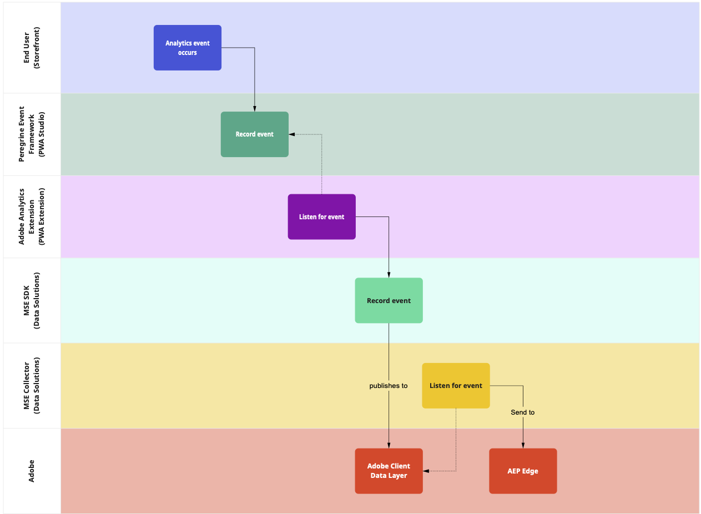

# Experience Platform analytics in PWA Studio

PWA Studio supports analytics through a built-in framework that sends events to your Adobe Commerce backend.
The following topics describe how to install, configure, and customize analytics to your specific needs.

- [Installing and configuring the Experience Platform analytics extension](installation-and-configuration/index.md)
- [Events reference](event-reference/index.md)
- [Custom events](custom-events/index.md)

## Eventing flow

The event flow starts with the page event and ends up in a storage layer. This diagram shows the path the event takes and the responsible software at each stage.

