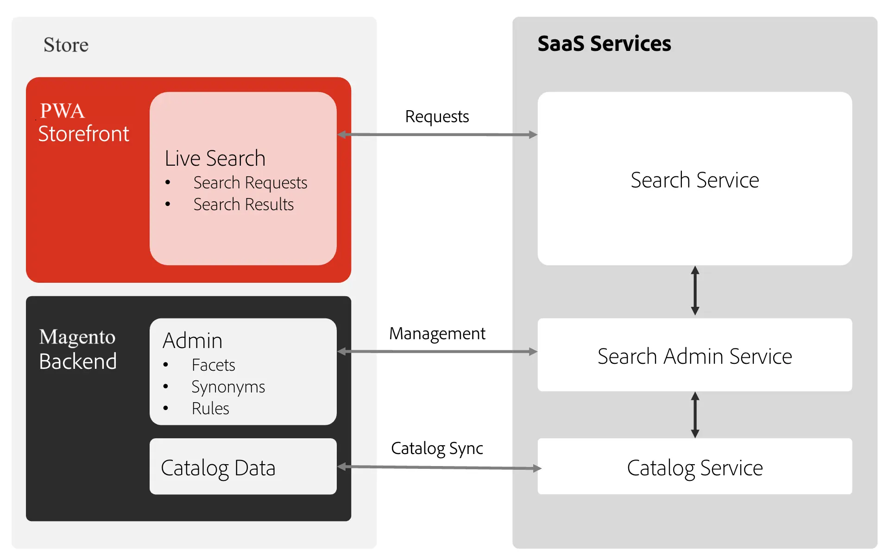

# Live Search

You can integrate Live Search powered by AI into your PWA Studio Storefront.

## Integration overview



Adobe's [Live Search](https://experienceleague.adobe.com/en/docs/commerce/live-search/overview) is a feature that replaces the standard search capabilities in Adobe Commerce. When the Live Search feature is enabled and configured, the default search text field is replaced with the Live Search text field. Live Search also includes the Product Listing Page (PLP) widget, which provides robust filtering capabilities when browsing search results.

The **Store** side includes your PWA storefront, which contains the event collector and Live Search layout template, and the backend, which includes the GraphQL endpoints, SaaS Export module, and the Admin UI.

## Install the Live Search module

<InlineAlert variant="info" slots="text"/>

Ensure that all prerequisites for Live Search installation on Adobe Commerce are completed as described in the official
[installation documentation](https://experienceleague.adobe.com/en/docs/commerce/live-search/install).

## Install the Live Search Backend module

After completing the steps from above, add an additional backend dependency that exposes the GraphQL queries for Live Search, which are then utilized by the PWA frontend package.

Run the following command to install the backend dependency:

```bash
composer require magento/module-live-search-graph-ql-pwa
```

```bash
bin/magento setup:di:compile
```

```bash
bin/magento cache:flush
```

## Install the Live Search Frontend PWA package

Live Search support on PWA requires installing the `venia-pwa-live-search` package and the Live Search module for Adobe Commerce.

<InlineAlert variant="info" slots="text">

The `venia-pwa-live-search` package requires [PWA Studio 14.3.1](https://github.com/magento/pwa-studio/releases/tag/v14.3.1) or later.

</InlineAlert>

1. You can install the PWA `venia-pwa-live-search` package from the NPM registry:
    - For projects cloned from GitHub run the following commands from the project root:

        ```sh
        yarn venia add -D @magento/venia-pwa-live-search
        ```

        **OR**

        ```sh
        npm install @magento/venia-pwa-live-search
        ```

    - For scaffolded projects run the following commands from project root:

        ```sh
        yarn add -D @magento/venia-pwa-live-search
        ```

        **OR**

        ```sh
        npm install @magento/venia-pwa-live-search
        ```

    This package contains the storefront functionality to integrate Live Search with PWA.

    This package can be used to integrate the following features of Live Search with PWA:
    - Live Search powered Search Bar
    - Live Search powered Category pages
    - Live Search powered Search Results Landing page

1. The backend functionality is provided by the [Live Search module for Adobe Commerce](https://experienceleague.adobe.com/en/docs/commerce/live-search/install).

1. Additionally, you need to install the `module-data-services-graphql` module that expands the application's existing GraphQL coverage to include fields required for storefront behavioral data collection.

   ```bash
   composer require magento/module-data-services-graphql
   ```

## Render Live Search results

To control the Live Search placement on your PWA storefront, use the local-intercept file. See the [extensibility framework](https://developer.adobe.com/commerce/pwa-studio/guides/general-concepts/extensibility/#intercept-files) documentation to learn more.

The location for `local-intercept.js` file may differ depending upon the method of initialization/setup of the project.

The location of the file for a cloned project is as follows:

- <pwa-root>/packages/venia-concept/local-intercept.js

For a scaffolded project the file can be found directly at the root of the project.

To render the Live Search units on your PWA storefront, use the methods described below.

### Render Live Search popover component

To enable the Live Search Popover component, the existing PWA search bar must be replaced by the **LiveSearchPopoverLoader** from the PWA module, to achieve this on a vanilla PWA instance the `local-intercept.js` should look like the following:

```jsx
const { Targetables } = require('@magento/pwa-buildpack');

function localIntercept(targets) {
    
    const liveSearchTargetables = Targetables.using(targets);

    //Search Bar settings

    //Target the file where vanilla PWA Search Bar form component is present.
    const VeniaSearchBar = liveSearchTargetables.reactComponent(
        '@magento/venia-ui/lib/components/SearchBar/searchBar.js'
    );

    //import the LiveSearchPopoverLoader component in the searchBar component file targeted above. 
    const LiveSearchBar = VeniaSearchBar.addImport(
        "import LiveSearchPopoverLoader from '@magento/venia-pwa-live-search/src/containers/LiveSearchPopoverLoader'"
    );

    //Replace the existing Search Bar form component with Live search SearchBar component
    VeniaSearchBar.replaceJSX(
        '<Form autoComplete="off" className={classes.form} initialValues={initialValues} onSubmit={handleSubmit} >',
        `<${LiveSearchBar} />`
    );

}

module.exports = localIntercept;
```

### Render Live Search results page (LiveSearchSRLPLoader) component

To integrate the Live Search Results Page, also known as `LiveSearchSRLPLoader` component with PWA, place the **LiveSearchSRLPLoader** component in the desired Page component and remove the non-required components from the page.
In a vanilla PWA instance the `local-intercept.js` should look like the following:

```jsx
const { Targetables } = require('@magento/pwa-buildpack');

function localIntercept(targets) {

    const liveSearchTargetables = Targetables.using(targets);

    //searchPage settings

    //Target the Component where to integrate the LiveSearchSRLPLoader component.
    const VeniaSearchPage = liveSearchTargetables.reactComponent(
        '@magento/venia-ui/lib/components/SearchPage/searchPage.js'
    );

    //import the LiveSearchSRLPLoader component in the Component file targeted above.
    const LiveSearchPage = VeniaSearchPage.addImport(
        "import LiveSearchSRLPLoader from '@magento/venia-pwa-live-search/src/containers/LiveSearchSRLPLoader'"
    );

    //Placement of the LiveSearchSRLPLoader component at desired location in targeted searchPage component.
    VeniaSearchPage.insertBeforeJSX(
        'div className={classes.sidebar}',
        `<${LiveSearchPage} />`
    );

    //Removing the non-required components from the searchPage component.
    VeniaSearchPage.removeJSX('div className={classes.sidebar}');
    VeniaSearchPage.removeJSX('div className={classes.searchContent}');

}

module.exports = localIntercept;
```

### Render Live Search category page (LiveSearchPLPLoader) component

To integrate the Live Search Category Page, also known as `LiveSearchPLPLoader` component with PWA, place the **LiveSearchPLPLoader** component in the desired Page component and remove the non-required components from the page.
In a vanilla PWA instance the `local-intercept.js` should look like the following:

```jsx
const { Targetables } = require('@magento/pwa-buildpack');

function localIntercept(targets) {

    const liveSearchTargetables = Targetables.using(targets);

    //category page settings

    //Target the Component where to integrate the LiveSearchPLPLoader component.
    const VeniaCategoryPageRoot = liveSearchTargetables.reactComponent(
        '@magento/venia-ui/lib/RootComponents/Category/category.js'
    );

    //import the LiveSearchPLPLoader component in the Component file targeted above.
    const LiveCategoryContentRoot = VeniaCategoryPageRoot.addImport(
        "import LiveSearchPLPLoader from '@magento/venia-pwa-live-search/src/containers/LiveSearchPLPLoader'"
    );

    //Placement of the LiveSearchPLPLoader component at desired location in targeted category Page component.
    VeniaCategoryPageRoot.insertAfterJSX(
        'CategoryContent categoryId={uid} classes={classes} data={categoryData} isLoading={loading} pageControl={pageControl} sortProps={sortProps} pageSize={pageSize}',
        `<${LiveCategoryContentRoot} categoryId={uid} />`
    );

    //Target the CategoryContent component from where we would like to remove some elements on category page.
    const VeniaCategoryPage = liveSearchTargetables.reactComponent(
        '@magento/venia-ui/lib/RootComponents/Category/categoryContent.js'
    );

    //Removing the non-required components from the categoryContent component.
    VeniaCategoryPage.removeJSX('<StoreTitle />');
    VeniaCategoryPage.removeJSX('div className={classes.contentWrapper}');
}

module.exports = localIntercept;
```
