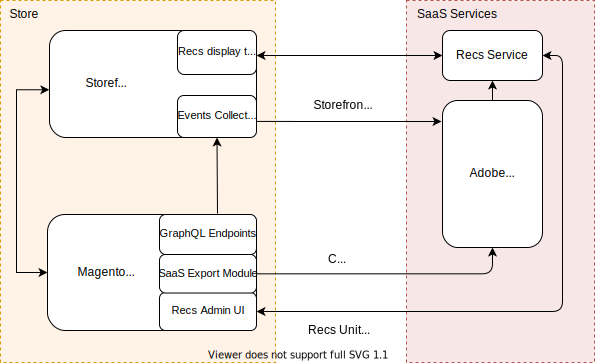

# Product Recommendations

You can integrate Product Recommendations powered by [Adobe Sensei](https://www.adobe.com/sensei.html) into your PWA Studio storefront.

## Integration overview



Adobe's [Product Recommendations powered by Adobe Sensei](https://experienceleague.adobe.com/en/docs/commerce-merchant-services/product-recommendations/overview) is a feature backed by several SaaS services.
The **Store** side includes your PWA storefront, which contains the event collector and recommendations layout template, and the backend, which includes the GraphQL endpoints, SaaS Export module, and the Admin UI.

After you install the Product Recommendations PWA extension on your store, it will start sending [behavioral data](https://experienceleague.adobe.com/en/docs/commerce-merchant-services/product-recommendations/developer/events) to Adobe Sensei with no additional setup.
Adobe Sensei processes this behavioral data along with the catalog data from the backend and calculates the product associations leveraged by the recommendations service.
At this point, the merchant can create and manage recommendation units from the Adobe Commerce Admin UI then fetch those product recommendation units from their PWA storefront.

## Install the Product Recommendations module

<InlineAlert variant="info" slots="text"/>

Before proceeding, complete all Product Recommendations prerequisites for Adobe Commerce. Follow the steps outlined in the official [installation documentation](https://experienceleague.adobe.com/en/docs/commerce/product-recommendations/getting-started/install-configure).

## Install the  Product Recommendations Backend module

Next, install an additional backend dependency.
Run the following commands to install the backend dependency:

```terminal
composer require magento/module-data-services-graphql
```

```terminal
magento/experience-platform-connector
```

```terminal
bin/magento setup:di:compile
```

```terminal
bin/magento cache:flush
```

## Install the Product Recommendations Frontend PWA package

Product Recommendations support on PWA requires installing the `venia-product-recommendations` package and the Product Recommendations module for Adobe Commerce.

<InlineAlert variant="info" slots="text"/>

The `venia-product-recommendations` package requires [PWA Studio 10.0.0](https://github.com/magento/pwa-studio/releases/tag/v10.0.0) or later.

1. You can install the PWA `venia-product-recommendations` package from the NPM registry:
    - For projects cloned from GitHub run the following commands from the project root:

        ```sh
        yarn venia add -D @magento/venia-product-recommendations
        ```

        ```sh
        yarn venia add -D @magento/venia-data-collector
        ```
  
        ```sh
        yarn venia add -D @magento/experience-platform-connector
        ```

        **OR**

        ```sh
        npm install @magento/venia-product-recommendations
        ```

        ```sh
        npm install @magento/venia-data-collector
        ```
  
        ```sh
        npm install @magento/experience-platform-connector
        ```

    - For scaffolded projects run the following commands from project root:

      ```sh
        yarn add -D @magento/venia-product-recommendations
        ```

        ```sh
        yarn add -D @magento/venia-data-collector
        ```

        ```sh
        yarn add -D @magento/experience-platform-connector
        ```

        **OR**

        ```sh
        npm install @magento/venia-product-recommendations
        ```

        ```sh
        npm install @magento/venia-data-collector
        ```

      ```sh
      npm install @magento/experience-platform-connector
        ```

## Create recommendation units

Creating a product recommendation unit for your PWA storefront is the same as [creating one for a theme](https://experienceleague.adobe.com/en/docs/commerce-merchant-services/product-recommendations/admin/create).
When you create a recommendation unit in the Admin UI panel, you will need to place components that render product recommendations on appropriate storefront pages. You will do this only once per [supported page type](https://experienceleague.adobe.com/en/docs/commerce-merchant-services/product-recommendations/overview#supportedrecs).

## Render recommendations

To control the recommendation unit placement on your PWA storefront, use the local intercept file. See the [extensibility framework][] documentation to learn more. To render the recommendation unit on your PWA storefront, use one of the methods described below.

### Venia UI component

The `Recommendations` component is part of the [venia-product-recommendations][] package.
It contains React components that do the following:

- Collect and send behavioral data to Adobe Sensei
- Fetch recommendations from the recommendations service
- Render the recommendation unit to your storefront page

#### Example

```jsx
//Render recommendations using visual component
import {
  VeniaProductRecommendations,
  PageTypes,
} from "@magento/venia-product-recommendations";

return <VeniaProductRecommendations pageType={PageTypes.CMS} />;
```

### Fetch data only

If you are not using the `venia-product-recommendations` package, you can call the recommendations service and receive a JSON payload.

#### Example

```js
import { PageTypes } from "@magento/venia-product-recommendations";
import useRecsData from "@magento/venia-product-recommendations/lib/hooks/useRecsData";

const { data, error, isLoading } = useRecsData({ pageType: PageTypes.CMS });
```

# Support Policy

### Supported Versions

Support is currently provided for **version 14.0.1 and above**.
This includes:

- Bug fixes
- Technical support and troubleshooting

### Upgrade Recommendation

To receive continued support, please ensure your environment is updated to **version 14.0.1 or later**. Refer to the official upgrade documentation for guidance on updating safely.

### Contact & Assistance

If you have questions about version support or need help upgrading, please contact the support team or open a support request through the appropriate support channel.

[venia-product-recommendations]: /guides/#custom-react-hooks-and-component
[extensibility framework]: /guides/general-concepts/extensibility/#intercept-files
