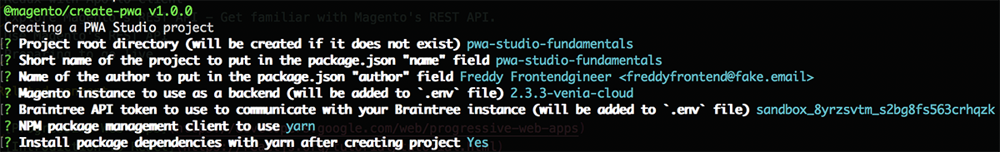
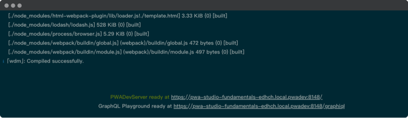

# Setup a storefront project

Follow this tutorial and learn to set up a new PWA Studio storefront project.

## Tutorial overview

This tutorial provides the first steps for working with PWA Studio by teaching you how to set up a new storefront project.
You will create a PWA Studio storefront project based on the [Venia concept storefront][] and configure it based on your environment.
To see a demo of the Venia concept storefront, visit [venia.magento.com][].

## Run the scaffolding tool

In your terminal, navigate to the directory where you want to install your storefront project and run the [scaffolding][] tool.

### Scaffolding tool commands

<CodeBlock slots="heading, code" repeat="3" languages="bash, bash, bash" />

#### yarn

```bash
yarn create @magento/pwa
```

#### npm

```bash
npm init @magento/pwa
```

#### npx

```bash
npx @magento/create-pwa
```

## Answer project setup questions

The scaffolding tool runs an interactive questionnaire in the terminal that determines how it should create your project.
Answer these questions to begin the project setup process.



After the scaffolding command completes, navigate to your project's root directory:

```bash
cd pwa-studio-fundamentals
```

The scaffolding command generates the minimum amount of files you need to run the Venia storefront.

## Add a custom hostname and SSL cert

The scaffolding tool sets up a working React development environment, but
this environment is not yet ideal for developing PWA storefronts.

PWA features, such as service workers and push notifications, require HTTPS secure domains, so
your development environment must serve content over HTTPS to match a production environment.

If you are working on more than one storefront project, each project must have a custom hostname to prevent clashing with service workers or ports.
Fortunately, PWA Studio provides an easy method of creating a custom domain and SSL certificate for your local development environment.

Use the [`create-custom-origin`][] sub-command from the [buildpack CLI][] to create a custom hostname and SSL cert:

```bash
yarn buildpack create-custom-origin ./
```

<InlineAlert variant="info" slots="text"/>

This feature requires administrative access, so it may prompt you for an administrative password at the command line.
It does not permanently elevate permissions for the dev process but instead, launches a privileged subprocess to execute one command.

## Start the development server

Use the following command to start the development server:

```bash
yarn watch
```



When the development server starts, it serves the content over a secure hostname and port.
It also uses hot reloading, which is a development feature that watches the file system for any changes.
When it detects a change it updates the application running in a browser.

You can stop the development server by pressing **CTRL + C** in the running server's terminal window.

## Update environment variables (optional)

This step is optional because the scaffolding command already adds the required environment variables to the environment file.

If you want to change [environment variables][], such as `MAGENTO_BACKEND_URL` or `BRAINTREE_TOKEN`, update your project's `.env` file and change the property values.

## Next steps

<DiscoverBlock width="45%" slots="link, text"/>

[Explore the files][]

Learn about the storefront project file structure.

<DiscoverBlock width="45%" slots="link, text"/>

[Common setup issues][]

Troubleshoot common setup issues.

[explore the files]: file-structure/
[post setup tasks]: post-setup-tasks/
[common setup issues]: issues/

[scaffolding]: pwa-buildpack/scaffolding/
[peregrine]: peregrine/
[venia concept storefront]: venia-pwa-concept/
[`create-custom-origin`]: pwa-buildpack/reference/buildpack-cli/create-custom-origin/
[buildpack cli]: pwa-buildpack/reference/buildpack-cli/
[environment variables]: pwa-buildpack/reference/environment-variables/core-definitions/
[explore the project structure]: tutorials/setup-project/project-structure/
[venia.magento.com]: http://venia.magento.com/
[http://0.0.0.0:10000/]: http://0.0.0.0:10000/
