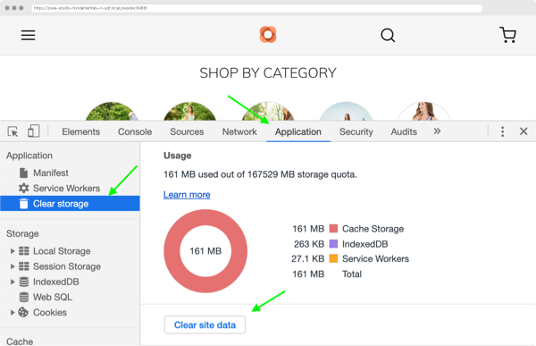
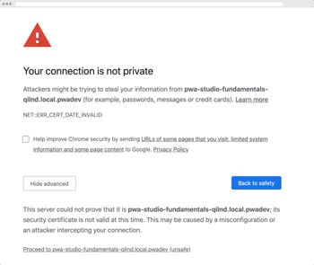

# Troubleshooting

Apply these fixes to address common issues you may encounter during project setup.

## Node version errors

If you get a node version error, verify you are using the correct node version.
Early versions of PWA Studio are not compatible with node v12.
Use a node version manager such as [n][] or [nvm][] to switch between different node versions.

If you are using Node 12, you may see the a deprecation warning in the log when you run the watch command.
This is caused by a project dependency used by PWA Studio and not by PWA Studio itself.

## Caching issues

If you are running into caching issues, clear the full application storage (not just the browser cache).

For example, in **Chrome**:

1. Open the _Developer Tools_.
2. In the _Application_ tab, select _Clear Storage_ on the left navigation.
3. Press the _Clear site data_ button.

## No Magento data

If your storefront is not getting data from Magento, make sure your development server can access the `MAGENTO_BACKEND_URL` in your `.env` file.

## Privacy error

If you get a _Privacy Error_ message in your browser, your project has an invalid or expired certificate.
See the [PWA Buildpack troubleshooting][] page for a solution to this issue.

## Other issues

If you encounter any other issues, ask the Magento community in the [#PWA][] Slack channel.

[n]: https://github.com/tj/n
[nvm]: https://github.com/nvm-sh/nvm/
[#pwa]: https://magentocommeng.slack.com/messages/C71HNKYS2
[pwa buildpack troubleshooting]: pwa-buildpack/troubleshooting/#untrusted-ssl-cert